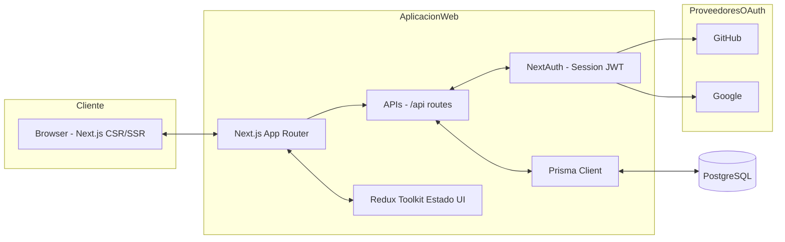
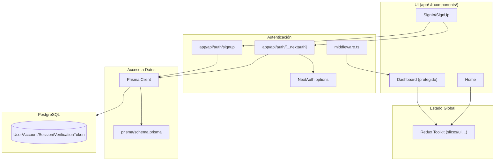
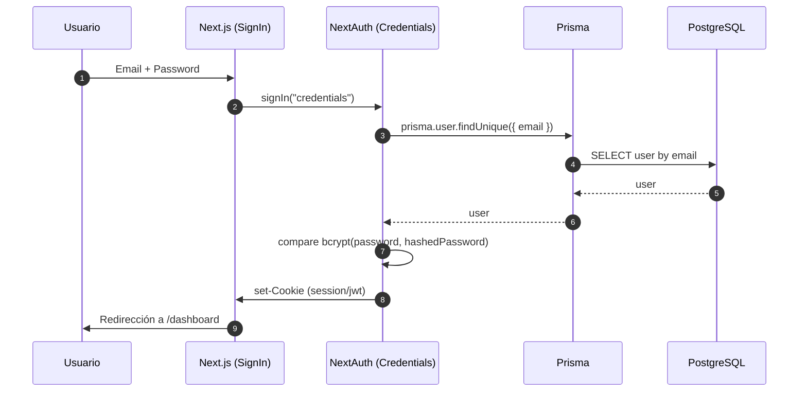
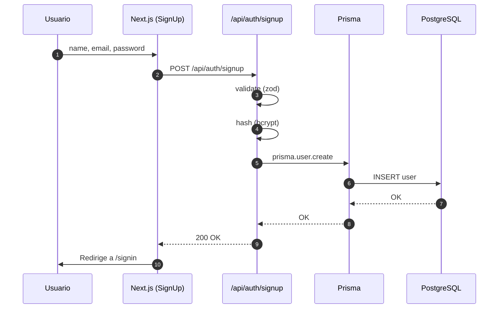
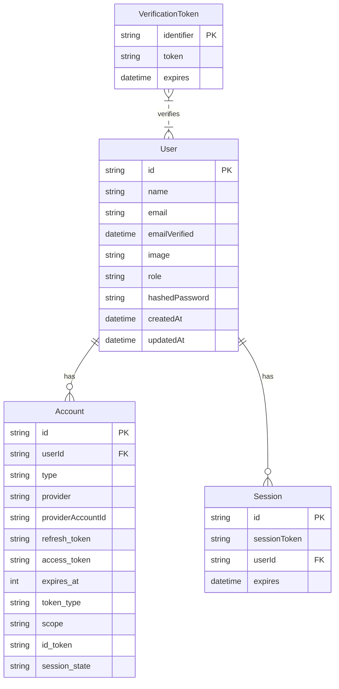
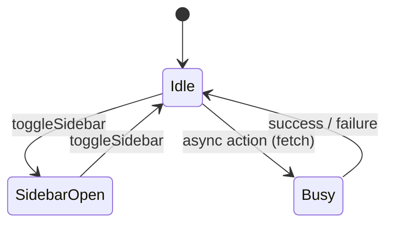
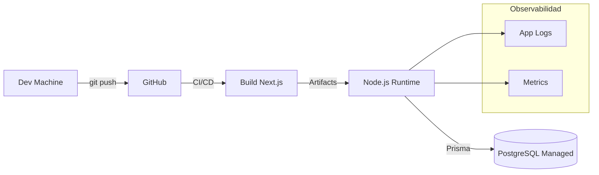

# Arquitectura de Nexora

Este documento resume la arquitectura actual y el plan de evolución del proyecto. Incluye diagramas **Mermaid** para ayudar a visualizar los componentes, flujos y despliegue.

> Estado actual: Frontend Next.js 15 (App Router) + Tailwind, y un Core **FastAPI** básico (endpoints de salud, auth demo y cotizaciones in‑memory) en este repositorio. Aún sin base de datos real.
> Plan futuro: API (FastAPI/Python) + DB (PostgreSQL) + cache/objetos (Redis/MinIO) + auth. Los diagramas marcan este objetivo.

> _Stack base_: **Next.js (App Router)**, **Redux Toolkit**, **NextAuth** (Prisma Adapter), **Prisma**, **PostgreSQL**. Opcionales: OAuth (GitHub/Google), Tailwind, shadcn/ui.

---

## 1) Visión general (Contexto del sistema) — Objetivo futuro

---

## 2) Módulos lógicos

> Ver también: [ADMIN_PANEL.md](./ADMIN_PANEL.md) para el detalle funcional del panel `/dashboard`.

---

## 3) Flujo de autenticación (Credentials)

### Flujo de registro

---

## 4) Modelo de datos (Auth + Roles)

> Nota: corresponde al `schema.prisma` de NextAuth con Adapter Prisma.

---

## 5) Estados de UI (Redux Toolkit)

> Mantén la UI reactiva (loading, errores) y deja la **lógica de negocio** en slices/ thunks.

---

## 6) Seguridad y protección de rutas
- `middleware.ts` aplica NextAuth a rutas como `/dashboard/*`.
- Sesión **JWT** con claims mínimos (`role`).
- Hash de contraseñas con **bcrypt**.
- Validación de payloads con **zod**.
- CSRF: NextAuth maneja protecciones para rutas de auth; para APIs propias, usa `POST` y valida origen si corresponde.

---

## 7) Despliegue (referencia)

> Puedes usar Vercel para el frontend (SSR) y una base gestionada (Railway, Supabase, RDS, etc.). Si usas un único contenedor, expón Next.js y conecta a Postgres externo.

---

## 8) Convenciones y rutas
- App Router en `src/app/`.
- API Routes en `src/app/api/*`.
- Auth en `src/app/api/auth/[...nextauth]` y `src/app/api/auth/signup`.
- Prisma en `src/lib/prisma.ts`.
- Config de NextAuth en `src/lib/auth.ts`.
- Estado global en `src/store/*`.

---

## 9) Roadmap (sugerido)
1. **Módulo Auth**: recuperar contraseña, verificación email.
2. **RBAC**: políticas por rol para endpoints y páginas.
3. **Testing**: unit (vitest/jest) + e2e (Playwright).
4. **Observabilidad**: logger estructurado + métricas.
5. **CI/CD**: linters, typecheck, tests, build Docker.

---

## 10) Cómo contribuir
- Convenciones de commits (Conventional Commits).
- PRs con descripción y checklist de pruebas.
- Revisión obligatoria para cambios en `auth/` y `db/`.

---

### 1.1 Operación LAN‑first e instalación
- Servidor principal: una sola máquina en el taller corre todo con Docker Compose (Node/Next.js + PostgreSQL + MinIO + opcional Redis).
- Clientes: tablets/PC/teléfonos se conectan por navegador a http://IP‑del‑host o http://nombre.lan. No instalan nada; se instala como PWA si se desea.
- Acceso externo opcional: solo para la ruta pública de aprobaciones, detrás de Cloudflare Tunnel.

### 1.2 Roles (RBAC) y capacidades
- Admin: configuración, usuarios, catálogos, reportes.
- Manager/Jefe: aprobar cotizaciones/trabajos, ver costos, cerrar órdenes.
- Cajero: cobranza, emisión de comprobantes.
- Mecánico: ver órdenes asignadas, subir evidencias (fotos/comentarios), cambiar estados de tareas.

### 1.3 Flujo de evidencia fotográfica (tableta del mecánico)
- La tableta abre la orden asignada y toca “Añadir evidencia”.
- Captura: input "file" con capture o getUserMedia; compresión en cliente (ej. 1600px máx, ~0.7 calidad) y borrado EXIF.
- Offline‑first: se guarda en IndexedDB con metadatos (workOrderId, takenAt, userId, deviceId); se encola para envío.
- Sincronización: cuando hay red, el SW envía al backend (API Next.js) o a MinIO mediante URL firmada. Restringir tamaño (p. ej., ≤4MB) y número por orden.
- Almacenamiento: bucket MinIO evidence/ por orden; DB guarda solo metadatos y la clave del objeto.
- Seguridad: RBAC en endpoint, límite de tasa, validación MIME, política de retención en MinIO.
